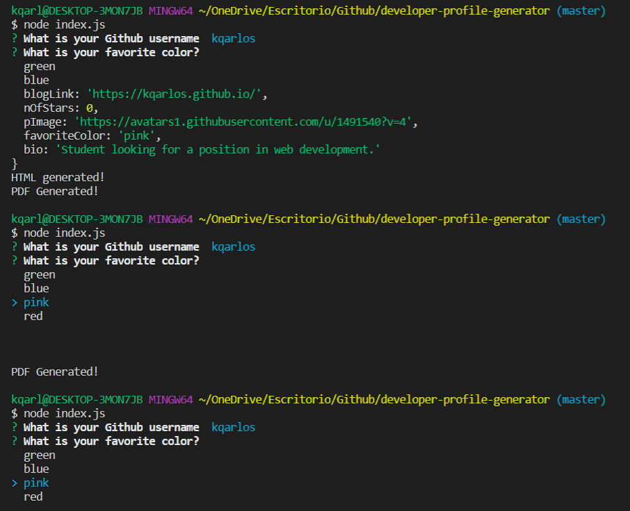

# Developer Profile Generator

</br>
<p align="center">
    
    
    
       
    
    
    
    
    
      
      
      
</p>

## Description

Generates a Github's user profile in PDF format given a Github's username and a chosen favorite color.

## Table of Contents

* [Installation](#installation)
* [Usage](#usage)
    * [Screenshots](#screenshots)
    * [Snippets](#snippets)
* [Credits](#credits)
* [License](#license)

## Installation

  Install dependencies and start the application in the command line

     npm i
     node index.js

<p align="center">
    <a href="https://kqarlos.github.io/developer-profile-generator"></a>
</p>

## Usage

### Screenshots

1. Generated PDF with username: _kqarlos_ and color choice: _red_


2. Command-line prompts with _inquirer_




### Snippets


1. Promise and callback

```javascript

getNumberOfStars(queryURL + "/repos").then(function (stars) {
            userInfo = {
                name: response.data.name,
                location: response.data.location,
                githubLink: response.data.html_url,
                nOfRepos: response.data.public_repos,
                nOfFollowers: response.data.followers,
                nFollowing: response.data.following,
                blogLink: response.data.blog,
                nOfStars: stars,
                pImage: response.data.avatar_url,
                favoriteColor: unserInput.color,
                bio: response.data.bio
            }
            console.log(userInfo);
            generateHTML();
        }).catch(function (err) {
            console.log(err);
        });
    
```
* This portion of code calls on _getNumberOfStars()_. This return a promise that once is resolved will continue to execute the callback function. In other words, only once _getNumberOfStars()_ resolves the _userInfo_ object will be set and once all the user info is set, we call the generateHTML function.


2. _getNumberOfStars(repos_url)_

```javascript

function getNumberOfStars(repos_url) {
    return new Promise(function (resolve, reject) {
        if (repos_url == null) 
            return reject(Error("Invalid URL!"));
        var count = 0;
        axios.get(repos_url).then(function (response) {
            response.data.forEach(element => {
                count += element.stargazers_count;
            });
            resolve(count);
        }).catch(function (error) {
            console.log("Error", error.message);
        });
    });
}


```
* This function returns a promise. This is because inside this function there is an _axios.get()_ call that runs asynchronouslly. Returning apromise will ensure that whatever code follows this function call will execute only after this promise is resolved. This avoids issues such as referencing a variable that has not yet been set.

## Credits 

### Author

- 💼 Carlos Toledo: [portfolio](https://kqarlos.github.io/)
- :octocat: Github: [kqarlos](https://www.github.com/kqarlos)
- LinkedIn: [carlos-toledo415](https://www.linkedin.com/in/carlos-toledo415/)

### Built With

</br>
<p align="center">
    <a href="https://developer.mozilla.org/en-US/docs/Web/HTML"></a>
    <a href="https://developer.mozilla.org/en-US/docs/Web/CSS"></a>
    <a href="https://www.javascript.com/"></a>
    <a href="https://getbootstrap.com/"></a>
    <a href="https://handlebarsjs.com/"></a>

</p>

## License

</br>
<p align="center">
    
</p>